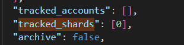
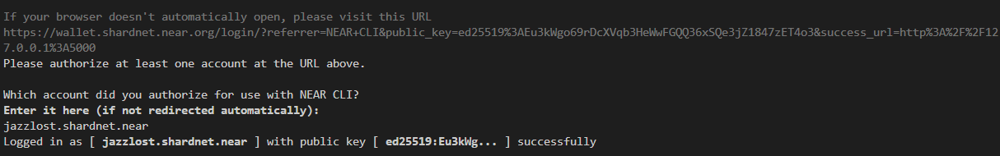
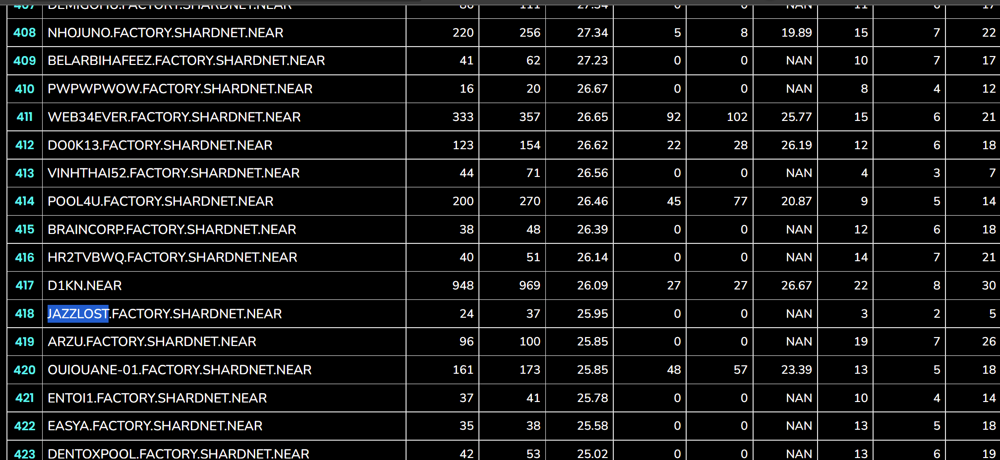

# Stake Wars：Episode III

[TOC]

### 前言

* 这篇文章是为 Stake Wars: Episode III - Challenge 5 所写的节点启动文档，记录了我的 **Shardnet** 节点启动步骤
* 节点启动环境：4-Core CPU / 8GB DDR4 / 500GB / Tencent Cloud / Ubuntu Server 20.04 LTS 64bit。节点费用大概 ￥360/月。

## Challenge 1

### 账户创建

* 首先需要创建一个 Shardnet 的账户作为节点的控制账户。从 [这里](https://wallet.shardnet.near.org/) 进入账户创建页面，创建步骤与 Mainnet 账户一致。

### Near-CLI 命令行工具下载

* 先更新下 apt

```shell
sudo apt update && sudo apt upgrade -y
```

* 安装 Node.js 与 npm 环境，已安装可以跳过

```shell
curl -sL https://deb.nodesource.com/setup_18.x | sudo -E bash -  
sudo apt install build-essential nodejs
PATH="$PATH"
```

* 然后可以检查下环境

```shell
node --version
npm -- version
```

* 安装命令行工具 near-cli

```shell
sudo npm install -g near-cli
```

* 检查下环境

```shell
near --version
```


### Shardnet 环境

* Near 有四个网络，我们需要切换到正确的网络进行交互：
  * GuildNet
  * TestNet
  * MainNet
  * **Shardnet**
* near-cli 可以通过命令行与节点进行交互，但是首先需要设置正确的交互网络环境变量 `NEAR_ENV`

```shell
export NEAR_ENV=shardnet
```

* 上面的设置在每次进入新的终端后都需要重新设置网络，也可以直接把环境变量写进 bash 的配置中

```shell
echo 'export NEAR_ENV=shardnet' >> ~/.bashrc
echo 'export NEAR_ENV=shardnet' >> ~/.bash_profile
source $HOME/.bash_profile
```

* 最后可以检查下当前的网络设置

```shell
echo $NEAR_ENV
```


## Challenge 2

### 节点环境

* Chunk Only Producer 节点的硬件要求如下，目前 Shardnet 存储占用为30GB左右，如果只是参加 StakingWar 的话可以暂时使用稍小的存储
* 首先可以检查下 CPU 是否支持

```shell
lscpu | grep -P '(?=.*avx )(?=.*sse4.2 )(?=.*cx16 )(?=.*popcnt )' > /dev/null \
  && echo "Supported" \
  || echo "Not supported"
```


* 安装下依赖环境

```shell
sudo apt install -y git binutils-dev libcurl4-openssl-dev zlib1g-dev libdw-dev libiberty-dev cmake gcc g++ python docker.io protobuf-compiler libssl-dev pkg-config clang llvm cargo
```

* 安装 python 和 pip 环境

```shell
sudo apt install python3-pip
```

* 安装 rust 的编译依赖环境

```shell
sudo apt install clang build-essential make
```

* 安装 rust 和 cargo, 出现如下图命令时，选择 1)Proceed with installation

```shell
curl --proto '=https' --tlsv1.2 -sSf https://sh.rustup.rs | sh
```


* 执行这个命令让 cargo 环境生效

```shell
source $HOME/.cargo/env
```

### 节点客户端

* 在自定义目录下 clone 客户端代码

```shell
git clone https://github.com/near/nearcore
cd nearcore
git fetch
```

* 切换到指定 commit

```shell
git checkout c1b047b8187accbf6bd16539feb7bb60185bdc38
```

* 编译客户端 **neard**

```shell
cargo build -p neard --release --features shardnet
```

* 编译完成后查看下版本信息

```shell
./target/release/neard --version
```


### 节点配置文件

* 节点的配置文件主要是这三个：
  * **config.json** : 里面可以对节点的运行，P2P，共识等功能进行配置
  * **gensis.json**：节点的创世状态配置，包括初始账户，合约，密钥等。这个配置文件也可以表示某个 snapshot 下的网络状态配置
  * **node_key.json**: 节点关联账户的公私钥信息

* 我们首先生成默认的配置文件

```shell
./target/release/neard --home ~/.near init --chain-id shardnet --download-genesis
```

* 然后需要修改 config.json 中的配置
  * boot_nodes：默认配置没有指定启动节点，这里需要指定一个
  * tracked_shards：默认配置没有指定验证的分片，这里可以指定为分片0
* 也可以执行下面的命令下载配置好的 config.json 进行替换

```shell
rm ~/.near/config.json
wget -O ~/.near/config.json https://s3-us-west-1.amazonaws.com/build.nearprotocol.com/nearcore-deploy/shardnet/config.json
```




### 启动节点

* 首先定位到 **nearcore** 目录，然后执行下面的命令, 看到下图输出说明已经启动成功，节点会先同步 全部**head**，然后再同步 **block** 

```shell
./target/release/neard --home ~/.near run
```


* 节点启动正常之后，可以先 ctrl+c 停止节点，之后我们会用 service 来启动节点

### 添加验证者账户

* 现在需要给节点授权验证者账户用来进行质押，奖励等工作，首先输入下面命令

```shell
near login
```

* 弹出的网页上进行账户的授权


* 网页授权完成后会转到无法加载的空页面，直接关闭就行，然后控台内输入刚才进行授权的账户名，等待返回成功结果 **successfully**



* 然后需要添加一个验证者账户的配置文件, <pool_id>是你的节点id,格式是 **xxx.factory.shardnet.near**

```shell
near generate-key <pool_id>
```

* 拷贝生成的配置文件

```shell'
cp ~/.near-credentials/shardnet/YOUR_WALLET.json ~/.near/validator_key.json
```

* 打开这个 **validator_key.json** 文件，将 `private_key` 改为 `secret_key`

```shell
{
  "account_id": "xxx.factory.shardnet.near",
  "public_key": "ed25519:****",
  "secret_key": "ed25519:****"
}
```

### 使用 Service 启动节点

* 打开 **neard.service** 文件进行 service 配置, 注意这里一般需要 sudo 权限

```shell
sudo vi /etc/systemd/system/neard.service
```

* 填入下面的配置，<USER>替换为系统的用户名，ExecStart 需要改为你的 neard 文件路径

```json
[Unit]
Description=NEARd Daemon Service

[Service]
Type=simple
User=<USER>
#Group=near
WorkingDirectory=/home/<USER>/.near
ExecStart=/home/<USER>/nearcore/target/release/neard run
Restart=on-failure
RestartSec=30
KillSignal=SIGINT
TimeoutStopSec=45
KillMode=mixed

[Install]
WantedBy=multi-user.target
```

* 这里可以新建一个 screen 窗口来单独运行 service

```shell
screen -S neard_service
```

* 在新弹出的控台窗口中启动 service

```shell
sudo systemctl enable neard
sudo systemctl start neard
```

* 之后任何配置的修改都需要重载 service

```shell
sudo systemctl reload neard
```

* ctrl + a + d 退出当前 screen
* 想要重新回到 near_service screen, 执行命令

```shell
screen -r neard_service
```

## challenge 3

### 创建质押池

* Near 是通过质押池与质押合约来保证进行质押交互的，质押池需要创建在账户上，同时账户也要配置到节点上。通过下面命令创建质押池

```shell
near call factory.shardnet.near create_staking_pool '{"staking_pool_id": "<pool id>", "owner_id": "<accountId>", "stake_public_key": "<public key>", "reward_fee_fraction": {"numerator": 5, "denominator": 100}, "code_hash":"DD428g9eqLL8fWUxv8QSpVFzyHi1Qd16P8ephYCTmMSZ"}' --accountId="<accountId>" --amount=30 --gas=300000000000000
```

* 这里的<pool id> 填写质押池的名字，例如我的质押池这里就填写 **jazzlost**，最后质押池的完整名字是 **jazzlost.factory.shardnet.near**。<accountId> 填写之前进行或授权的节点账户，我这里是 **jazzlost.shardnet.near**。<public key> 可以在之前的 **validator_key.json** 文件中找到。下面是我的节点创建命令, 创建成功可以看到返回 **successfully created**

```shell
near call factory.shardnet.near create_staking_pool '{"staking_pool_id": "jazzlost", "owner_id": "jazzlost.shardnet.near", "stake_public_key": "ed25519:*****", "reward_fee_fraction": {"numerator": 5, "denominator": 100}, "code_hash":"DD428g9eqLL8fWUxv8QSpVFzyHi1Qd16P8ephYCTmMSZ"}' --accountId="jazzlost.shardnet.near" --amount=30 --gas=300000000000000
```


* 节点的佣金可以通过下面的命令来调整

```shell
near call <pool_name> update_reward_fee_fraction '{"reward_fee_fraction": {"numerator": 1, "denominator": 100}}' --accountId <account_id> --gas=300000000000000
```

### 质押操作

* 创建完质押池就可以进行质押了，只有质押量达到最低席位要求的节点才能被选中为出块节点, <staking_pool_id> 填写完整质押池名称 **xxx.factory.shardnet.near**, <amount> 填写质押数量，<accountId> 填写授权过给节点的账户

```shell
near call <staking_pool_id> deposit_and_stake --amount <amount> --accountId <accountId> --gas=300000000000000
```

* 如果需要解除质押，可以执行下面命令

```shell
near call <staking_pool_id> unstake_all --accountId <accountId> --gas=300000000000000
```

* 执行接触质押需要等待2-3个 epochs，然后就可以取出质押代币了

```shell
near call <staking_pool_id> withdraw '{"amount": "<amount yoctoNEAR>"}' --accountId <accountId> --gas=300000000000000
```

### 质押信息查询

* 先 ping 一下节点更新节点信息, <staking_pool_id> 填写完整质押池名字 **xxx.factory.shardnet.near**

```shell
near call <staking_pool_id> ping '{}' --accountId <accountId> --gas=300000000000000
```

* 查询质押池总的余额

```shell
near view <staking_pool_id> get_account_total_balance '{"account_id": "<accountId>"}'
```


* 查询质押量

```shell
near view <staking_pool_id> get_account_staked_balance '{"account_id": "<accountId>"}'
```


## Challenge 4

### Proposals 脚本

* 节点需要在每个 epoch 内执行 ping 操作来申请下一轮出块的 proposal, 这里可以通过 crontab 脚本进行自动化

* 首先创建一个 shell 脚本。<USER_ID> 填写系统用户名，<YOUR_POOL_ID> 填写质押池完整名称，<YOU_ACCOUNT_ID> 填写授权的账户

```shell
#!/bin/sh
# Ping call to renew Proposal added to crontab

export NEAR_ENV=shardnet
export LOGS=/home/<USER_ID>/logs
export POOLID=<YOUR_POOL_ID>
export ACCOUNTID=<YOUR_ACCOUNT_ID>

echo "---" >> $LOGS/all.log
date >> $LOGS/all.log
near call $POOLID.factory.shardnet.near ping '{}' --accountId $ACCOUNTID.shardnet.near --gas=300000000000000 >> $LOGS/all.log
near proposals | grep $POOLID >> $LOGS/all.log
near validators current | grep $POOLID >> $LOGS/all.log
near validators next | grep $POOLID >> $LOGS/all.log

```

* 然后创建一下输出日志的保存目录, 同时添加读写权限

```shell
mkdir $HOME/logs
chmod +x $HOME/scripts/ping.sh
```

* 然后创建一个 crontab

```shell
crontab -e
```

* 新打开的文件末尾添加触发任务, 保存退出

```shell
0 */2 * * * sh /home/<USER_ID>/scripts/ping.sh
```

* 然后启动 crond 任务

```shell
service crond start
```

*  explorer 可以看到节点每两个小时自动执行 ping


### 网络信息

* 执行下面命令可以在控台打印P2P网络信息

```shell
journalctl -n 100 -f -u neard | ccze -A
```


* 日志中的 #1657223是当前的区块高度，后面是区块哈希，100 validators是当前网络验证者数量，30 peers 是节点的 peer数量，后面是一些网络信息

* 执行下面命令可以查看本地节点版本信息

```shell
sudo apt install curl jq
```

```shell
curl -s http://127.0.0.1:3030/status | jq .version
```


* 可以在 [ShardNet Uptime Scoreboard ](https://openshards.io/shardnet-uptime-scoreboard/) 查看自己节点的在线时间，出块时间，节点排名等信息

